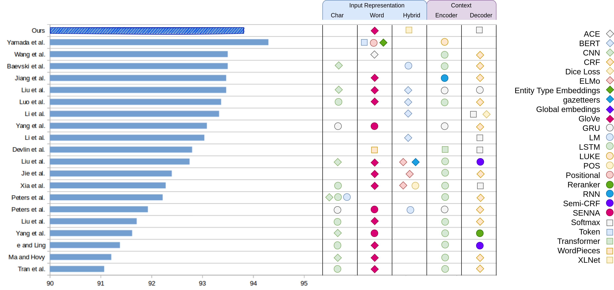

# Named entity recognition architecture combining contextual and global features

## Description

Named  entity  recognition  (NER)  is  an  information  extraction  techniquethat aims to locate and classify named entities (e.g., organizations, locations,...) within a document into predefined categories. Correctly identifying these phrases plays a significant role in simplifying the progress of retrieving information. However, it is still adifficult task because named entities (NEs) have multiple forms and they are contextdependent.  While  the  context  can  be  represented  by  contextual  features,  the  global relations are often misrepresented by those models. 

We propose the combination of contextual features from XLNet and global features from Graph Convolution Network (GCN) to enhance NER performance. Experiments over a widely-useddataset, CoNLL 2003, show the benefits of our strategy, with results competitive with the state of the art.

---

## Implementation

### 1. Requirements

All the necessary library are noted in [requirements.txt](./requirements.txt), please run the following command to install:

```python
pip install -r requirements.txt
```
### 2. Training models

Run the following command to train the model:
```python
btslen.sh
```
The `train.py` contains XLNet model whereas the `combined_train.py` includes the combination of XLNet and GCN, which is also our finalized model. Feel free to change the hyperparameters inside `btslen.sh` for further experiments and model tuning. 

---

## Results

### 1. Performance between joint architecture vs standalone one.

|Embeddings|F1-score|
|-|-|
|Global features| 88.63 |
|Contextual features |93.28 |
|Global + contextual features |93.82 |

### 2. Performance evaluation per entity type.

|Entity types|Precision|Recall|F1-score|
|-|-|-|-|
|LOC |94.15|93.53|93.83| 
|MISC|81.33|81.89|81.62|
|ORG |88.97|92.29|90.60|
|PER |96.67|97.09|96.88|

### 3. Comparison of our proposal against SOTA techniques.

<center></center>

---
## References
- Named entity recognition architecture combining contextual and global features.

---

## Contributors:
- [Hồng Hạnh](https://github.com/honghanhh)
- Prof. dr. [Nicolas SIDERE](https://github.com/nsidere)
- Prof. dr. [Antoine DOUCET](https://github.com/antoinedoucet)
- Prof. dr. [Jose MORENO](https://github.com/jgmorenof)
- Asst. prof. dr. [Senja POLLAK](https://github.com/senjapollak).