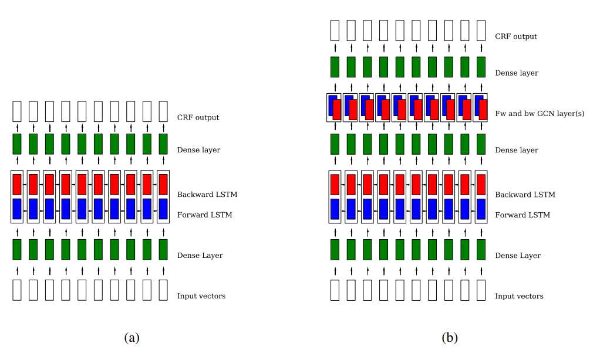
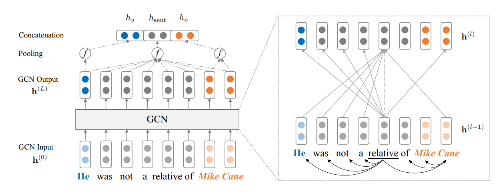

# [Internship: Multi-lingual NER taggings]

__Superviors__: 
- Prof. Nicolas __SIDERE__
- Prof. Antoine __DOUCET__
- Prof. Jose __MONERO__. 

__Student__: __TRAN__ Thi Hong Hanh.

### __Task 1__:

- [x] Implement the code using XLNet for NER training and prediction on the CONLL2003 data.
  
- [x] Reimplement on multiple datasets of NER including languages of the Embeddia project (Slovenian, Finnish, Estonian, etc.)
  - This link https://filesender.renater.fr/?s=download&token=fee352ab-62d6-945d-7a72-88d18c0dfd54 

- [x] Recommended readings:
  - [x] [__XLNet__](https://arxiv.org/pdf/1906.08237.pdf}): Yang, Z., Dai, Z., Yang, Y., Carbonell, J., Salakhutdinov, R. R., & Le, Q. V. (2019). Xlnet: Generalized autoregressive pretraining for language understanding. In Advances in neural information processing systems (pp. 5754-5764).
  - [x] [__BERT__](https://arxiv.org/pdf/1810.04805.pdf): Devlin, J., Chang, M. W., Lee, K., & Toutanova, K. (2018). Bert: Pre-training of deep bidirectional transformers for language understanding. arXiv preprint arXiv:1810.04805.
  - [x] [__BERT+NER__](https://www.aclweb.org/anthology/W19-3712.pdf): Arkhipov, M., Trofimova, M., Kuratov, Y., & Sorokin, A. (2019, August). Tuning multilingual transformers for language-specific named entity recognition. In Proceedings of the 7th Workshop on Balto-Slavic Natural Language Processing (pp. 89-93).

### __Task 2__:
- Investigate multilingual word embeddings that can support our interested NER languages:
  - [x] [__FastText__](https://fasttext.cc/): 
    - Trained on __Common Crawl__ and __Wikipedia__ with 300 dimension and n_gram of length 5.
    - Support 157 languages, including English, Slovenian, Finnish, Estonian.
    - Flair supports to use FastText as word embeddings, also test in [__flair_ner__](https://github.com/honghanhh/multiligualNER/embeddings/flair_embeddings.ipynb).
  - [x] [__Flair__](https://github.com/flairNLP/flair): 
    - Support 17 languages, including English, Slovanian(419,744,423 tokens), and Finish (427,194,262 tokens).
    - List of 14 word embeddings that Flair support: [__List__](https://github.com/flairNLP/flair/blob/master/resources/docs/TUTORIAL_4_ELMO_BERT_FLAIR_EMBEDDING.md).
    - Can stack, mix, match word embeddings (i.e Flair, ELMo, BERT and classical one), test word embeddings in [__flair_ner__](https://github.com/honghanhh/multiligualNER/embeddings/flair_embeddings.ipynb).
  - [x] [__Stanza__](https://github.com/stanfordnlp/stanza) :
    - Support about 70 languages, including English, Slovenian, Finnish, and Estonian.

  
### __Task 3__ (20/04/2020 - 26/04/2020):
- [x] Implement XLNet to reach SOTA benchmark (at least 91% F1-score).
  - Log file in this [link](https://github.com/honghanhh/multiligualNER/bert-ner/logs/XLNet_20-02-20.out).
  
  ```
  =========eval at epoch=4=========
  processed 55044 tokens with 5942 phrases; found: 5950 phrases; correct: 5878.
  accuracy:  99.27%; (non-O)
  accuracy:  99.85%; precision:  98.79%; recall:  98.92%; FB1:  98.86
                LOC: precision:  98.55%; recall:  99.73%; FB1:  99.13  1859
              MISC: precision:  97.62%; recall:  97.72%; FB1:  97.67  923
                ORG: precision:  99.17%; recall:  97.69%; FB1:  98.42  1321
                PER: precision:  99.35%; recall:  99.62%; FB1:  99.48  1847
  num_proposed:8611
  num_correct:8540
  num_gold:8603
  precision=0.9918
  recall=0.9927
  f1=0.9922
  weights were saved to checkpoints/finetune/4.pt
  =========eval at epoch=4=========
  processed 50350 tokens with 5648 phrases; found: 5757 phrases; correct: 5204.
  accuracy:  93.80%; (non-O)
  accuracy:  98.38%; precision:  90.39%; recall:  92.14%; FB1:  91.26
                LOC: precision:  91.34%; recall:  94.84%; FB1:  93.06  1732
              MISC: precision:  81.04%; recall:  79.77%; FB1:  80.40  691
                ORG: precision:  87.67%; recall:  90.79%; FB1:  89.20  1720
                PER: precision:  96.28%; recall:  96.10%; FB1:  96.19  1614
  num_proposed:8324
  num_correct:7609
  num_gold:8112
  precision=0.9141
  recall=0.9380
  f1=0.9259
  ```
  - Saved logs in this [link](https://github.com/honghanhh/multiligualNER/bert-ner/finetune/)
  - Saved checkpoints in this [link](https://github.com/honghanhh/multiligualNER/bert-ner/checkpoints/)
- [x] Upgrade memory in Colab, test in this [link](https://towardsdatascience.com/upgrade-your-memory-on-google-colab-for-free-1b8b18e8791d).
  ```
  a = []
  while(1):
    a.append(‘1’)
  ```
  - It works !!!!
- [x] Calculate predictions using [__Flair__](https://github.com/flairNLP/flair) and [__Stanza__](https://github.com/stanfordnlp/stanza).
  - Prediction result files of each approach are in [eng.testb.2.examples.txt.flair.new](https://github.com/honghanhh/multiligualNER/enconll03_baselines/eng.testb.2.examples.txt.flair.new) and [eng.testb.2.examples.txt.stanza.new](https://github.com/honghanhh/multiligualNER/enconll03_baselines/eng.testb.2.examples.txt.stanza.new), respectively.
  - Note of stanza model:
  ```
  stanza.download('en', processors={'tokenize': 'ewt', 'ner': 'conll03'})
  ```
- [x] Evaluate the performance using __get_score.py__ in this [github](https://github.com/Adaxry/GCDT/tree/master/data/conll03).
    - Evaluating data: [eng.testb.2.examples.txt](https://github.com/honghanhh/multiligualNER/enconll03_baselines/result/eng.testb.2.examples.txt).
    - __Stanza__: 
      - Generate __510/50120__ bad datas.
      - Predicting result is saved in [eng.testb.2.examples.txt.stanza.new](https://github.com/honghanhh/multiligualNER/enconll03_baselines/result/eng.testb.2.examples.txt.stanza.new).
      - Wrong predictions are collected in [eng.res.stanza.txt](https://github.com/honghanhh/multiligualNER/enconll03_baselines/result/eng.res.stanza.txt).
    - __Flair__: 
      - Generate __20151/50120__ bad datas. 
      - Predicting result is saved in [eng.testb.2.examples.txt.flair.new](https://github.com/honghanhh/multiligualNER/enconll03_baselines/result/eng.testb.2.examples.txt.flair.new).
      - Wrong predictions are collected in [eng.res.flair.txt](https://github.com/honghanhh/multiligualNER/enconll03_baselines/result/eng.res.flair.txt).
- Recommend papers about graph embeddings:
  - [x] Graph Convolutional Networks for Named Entity Recognition - 2017.
    - Paper link: [GCN](https://www.aclweb.org/anthology/W17-7607.pdf).
    - Source code: [gcn_ner](https://github.com/contextscout/gcn_ner).
    - Keynotes:
      - Input vectors = Morphological embeddings + POS embeddings + word embeddings.
      - The bi-directional architectures: (a) LSTM and (b) GCN:
          
      - Dependency trees play a positive role for entity recognition by using a GCN to boost the
  results of a bidirectional LSTM.
  - [x] Deeper insights into graph convolutional networks for semi-supervised learning - 2018. 
    - Paper link: [GCN](https://arxiv.org/pdf/1801.07606.pdf).
    - Source code:
    - Keynotes:
      - Use GCN for __semi-supervised learning__.
      - Pros:
        - The graph convolution – Laplacian smoothing helps making the classification problem much easier
        - The multi-layer neural network is a powerful feature extractor. 
        - Cons:
          - The graph convolution is a localized filter, which performs unsatisfactorily with few labeled data.
          - The neural network needs considerable amount of labeled data for validation and model selection.
      - Solutions: __co-training__ vs __self-training__ GCN (spatial vs spectral).
      - Graph convolution of the GCN model is actually a special form of Laplacian smoothing (mix the features of a vertex and its nearby neighbors).
  - Semi-supervised classification with graph convolutional networks - 2017.
    - Paper link: [GCN](https://arxiv.org/pdf/1609.02907.pdf).
    - Source code:
    - Keynotes:
      - Updating
  - [x] Graph convolution over pruned dependency trees improves relation extraction. 
    - Paper link: [GCN](https://www.aclweb.org/anthology/D18-1244.pdf).
    - Source code:
    - Keynotes:
      - Extract relation using GCN to efficiently pool information over arbitrary dependency structures.
      - Use new pathcentric pruning technique to help dependency-based models maximally remove irrelevant information without damaging crucial content to improve their robustness.
      - The architecture:
          

### __Task 4__:
- [x] Double check stanza and flair baselines.
  - Data: [eng.testb.2.examples.txt](https://github.com/honghanhh/multiligualNER/enconll03_baselines/result/eng.testb.2.examples.txt).
  - [x] Flair:
    - Syntax:
    ```
    python get_score.py -predict_file ./result_baselines/eng.testb.2.examples.txt.flair.new -golden_file eng.testb.2.examples.txt -result_file ./result_baselines/flair.txt
    ```
    - Result:
    ```
    Generate 510/50120 bad datas when evaluating ./result_baselines/eng.testb.2.examples.txt.flair.new processed 45925 tokens with 5446 phrases; found: 5428 phrases; correct: 5275.
    accuracy:  99.56%; precision:  97.18%; recall:  96.86%; FB1:  97.02
                LOC: precision:  96.49%; recall:  96.14%; FB1:  96.32  1626
              MISC: precision:  98.67%; recall:  97.37%; FB1:  98.01  600
                ORG: precision:  95.78%; recall:  95.60%; FB1:  95.69  1612
                PER: precision:  98.74%; recall:  98.68%; FB1:  98.71  1590
    ```
  - [x] Stanza:
      - Syntax:
      ```
      python get_score.py -predict_file ./result_baselines/eng.testb.2.examples.txt.stanza.new -golden_file eng.testb.2.examples.txt -result_file ./result_baselines/stanza.txt
      ```
      - Result:
      ```
      Generate 577/50120 bad datas when evaluating ./result_baselines/eng.testb.2.examples.txt.stanza.new
      processed 45858 tokens with 5420 phrases; found: 5397 phrases; correct: 5230.
      accuracy:  99.50%; precision:  96.91%; recall:  96.49%; FB1:  96.70
                    LOC: precision:  96.02%; recall:  95.90%; FB1:  95.96  1632
                  MISC: precision:  98.67%; recall:  97.37%; FB1:  98.01  600
                    ORG: precision:  95.33%; recall:  95.03%; FB1:  95.18  1584
                    PER: precision:  98.73%; recall:  98.24%; FB1:  98.49  1581
      ```